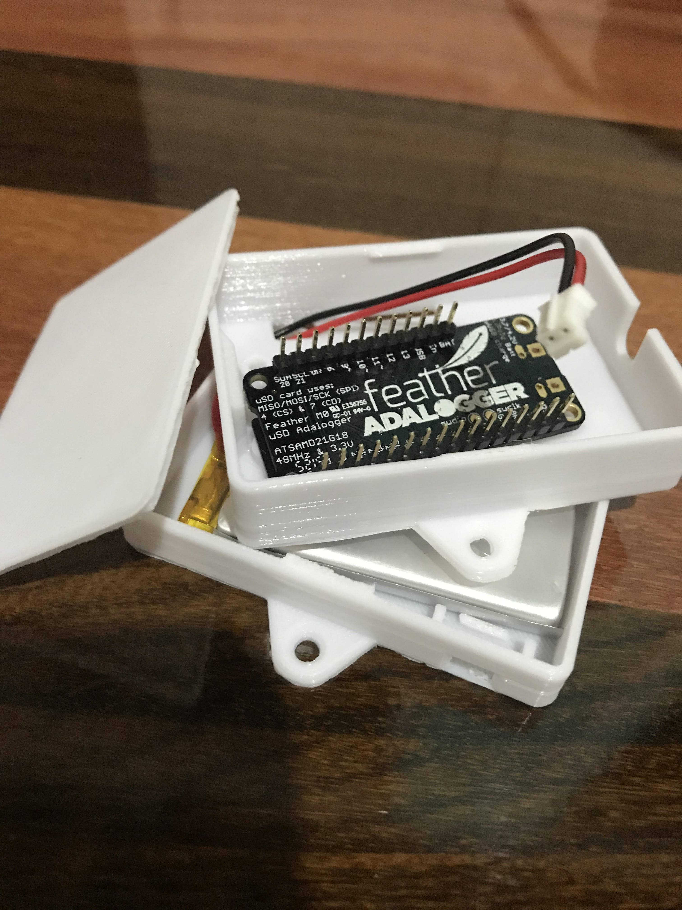

# Data logger

## About 
This proyect allows recording data of different gases from a biodigester. For that, it is used a microcontroller with different gass sensors who are record data into a SD Card. 

The microcontroller have two sources of energy, the main is by a charged with the electric current and the other one is by an external battery. The last one is in case of the electric current charged fail.
 
## Microcontroller
Adafruit feather m0 adalogger. Code written using Arduino IDE. 

+info: https://learn.adafruit.com/adafruit-feather-m0-adalogger/overview

## Sensors 

### MQ-04 

+info https://www.sparkfun.com/datasheets/Sensors/Biometric/MQ-4.pdf

### MQ-135

+info https://www.olimex.com/Products/Components/Sensors/Gas/SNS-MQ135/resources/SNS-MQ135.pdf

### Process of sensors calibration
--in progress--

## Data
The data is written in a .txt file with the name "ANALOGXX" where each X can be a number from 0 to 9. That format name is for avoid overwrite files.

Into the "ANALOGXX" file, each row represent a data reading. Each sensor data is separed by  comma "," , and the last value of the row is the date of the moment when the data was taken.

The id of each column can be found in the "FORMAT.TXT" file.

## Batteries

### Principal

+info https://www.crcibernetica.com/wall-adapter-power-supply-5v-3a-type-c-adapter/ 
### external
+info https://www.crcibernetica.com/lithium-ion-polymer-battery-3-7v-1200mah/

## Case
The microcontroller, batteries and sensors are mounting into a case. 

+info: https://www.thingiverse.com/thing:2209964/files

## Authors

* Mauro López J - lopezjimenezmauro05@gmail.com

* Marianne Hull C - mahullc@gmail.com
